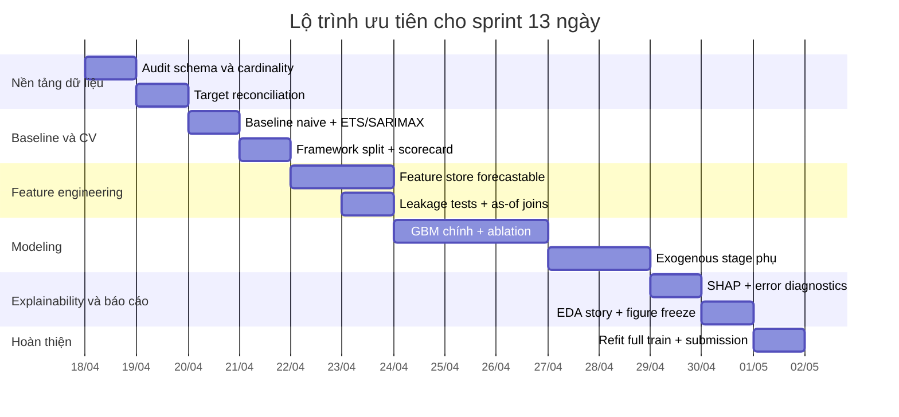

# Khung nghiên cứu toàn diện cho bài toán dự báo doanh thu hằng ngày

## Tóm tắt điều hành

Đề bài vòng 1 mô tả một doanh nghiệp thời trang thương mại điện tử tại entity["country","Việt Nam","southeast asia"], với dữ liệu huấn luyện từ 2012-07-04 đến 2022-12-31, bài toán dự báo `Revenue` cho giai đoạn 2023-01-01 đến 2024-07-01, ràng buộc không được dùng dữ liệu ngoài, phải nộp mã nguồn tái lập được, và trong báo cáo phải có phần giải thích mô hình bằng SHAP hoặc tương đương. Đồng thời, toàn bộ chấm điểm của vòng gồm 60 điểm cho EDA, 20 điểm cho forecasting, 20 điểm cho MCQ; phần forecasting lại tách thành hiệu suất leaderboard và báo cáo kỹ thuật. Vì vậy, framework đúng không phải chỉ là “chạy một mô hình tốt”, mà là xây một pipeline thống nhất để cùng lúc phục vụ audit dữ liệu, EDA, backtest, giải thích mô hình, và nộp `submission.csv`. fileciteturn0file0

Quyết định nghiên cứu quan trọng nhất là kỷ luật về **tính khả dụng của đặc trưng ở thời điểm dự báo**. Hầu hết tín hiệu mạnh trong 15 bảng — đơn hàng, khuyến mãi thực tế, web traffic, tồn kho, hoàn trả, đánh giá — đều là dữ liệu lịch sử đến cuối 2022, trong khi tập test 2023–2024 bị ẩn. Vì vậy, framework nên tách rõ ba tầng: đặc trưng biết trước tại ngày dự báo; đặc trưng phải dự báo phụ trước khi dùng cho mô hình doanh thu; và đặc trưng chỉ dùng cho EDA/chẩn đoán chứ không được đưa thẳng vào mô hình cuối. fileciteturn0file0

Một điểm cần khóa rất sớm là quy tắc đánh giá. Bản mô tả đính kèm nêu ba chỉ số MAE, RMSE, và R² cho Phần 3; trong khi trích đoạn rules trên trang cuộc thi chính thức hiện cho biết leaderboard được chấm bằng MAE trên cột `Revenue`, còn các chỉ số khác có thể chỉ đóng vai trò bổ sung. Kế hoạch an toàn là dùng **MAE trên `Revenue` làm tiêu chí online ưu tiên**, nhưng vẫn lưu đầy đủ scorecard MAE–RMSE–R² cho mọi backtest và cho báo cáo kỹ thuật. Cũng cần lưu ý rằng file nộp vẫn phải có các cột `Date, Revenue, COGS` theo đúng thứ tự mẫu. fileciteturn0file0 citeturn7search0turn5search1

## Mục tiêu nghiên cứu và giả định vận hành

Mục tiêu vận hành của kế hoạch này là tạo ra một workflow mà một nhà nghiên cứu khác có thể chạy lại từ đầu đến cuối mà không phải đoán ý đồ ban đầu. Cụ thể, workflow cần đạt bốn đầu ra: khóa được định nghĩa target; thiết kế được feature store cấp ngày có kiểm soát leakage; chọn được mô hình theo backtest đúng chiều thời gian; và sinh được trọn bộ hiện vật nộp bài gồm báo cáo, notebook, mã pipeline, và `submission.csv` chuẩn định dạng. Những yêu cầu đó bám trực tiếp vào brief của cuộc thi và các quy tắc nộp bài. fileciteturn0file0

Các câu hỏi nghiên cứu nên dẫn dắt toàn bộ dự án gồm:  
- `Revenue` trong `sales.csv` thực chất được xây từ những thành phần giao dịch nào, và quan hệ của nó với `payments`, `order_items`, `returns`, `shipping_fee`, `COGS` là gì.  
- Mô hình chỉ dùng `Revenue` lịch sử và lịch mùa vụ có mạnh đến đâu trước khi thêm dữ liệu đa nguồn.  
- Những tín hiệu đa nguồn nào vẫn còn giá trị **sau khi** áp ràng buộc “không biết tương lai tại 2023–2024”.  
- Các biến dẫn dắt nào có tính “leading” thực sự ở horizon 7, 28, 91, và 548 ngày.  
- Sai số tập trung ở đâu: đỉnh mùa vụ, cuối tháng, giai đoạn đậm khuyến mãi, hay các tháng có tồn kho căng.  
- Việc thêm một tầng forecast phụ cho traffic/promo/inventory có cải thiện đủ lớn để đáng đổi lấy độ phức tạp hay không. fileciteturn0file0

Các giả định nên được ghi rõ từ đầu, vì brief có vài điểm có thể không nhất quán với file thực tế. Thứ nhất, **schema CSV thực tế luôn là nguồn chân lý cao nhất** nếu khác mô tả prose; cần xác minh ngay các sai khác như `sales.csv` so với `sales_train.csv`, hay việc `web_traffic.csv` có thật sự có `conversion_rate` hay không. Thứ hai, chỉ được xem một biến là “forecast-time known” nếu nó tồn tại hoặc có thể suy ra tại ngày dự báo mà không dùng dữ liệu tương lai; nếu không, biến đó chỉ được dùng dưới dạng feature đã lag hoặc feature do mô hình phụ dự báo ra. Thứ ba, vì file nộp yêu cầu cả `COGS`, nên dù leaderboard có thể chỉ dùng `Revenue`, pipeline cuối vẫn cần một nhánh sinh `COGS` leakage-free. fileciteturn0file0 citeturn7search0turn5search1

Thứ tự nguồn cần ưu tiên cũng nên được chuẩn hóa ngay từ ngày đầu. Ưu tiên cao nhất là **raw CSV và audit schema sinh ra từ chính dữ liệu**. Ưu tiên kế tiếp là brief tiếng Việt đính kèm từ VinTelligence và entity["organization","VinUniversity","hanoi university"]. Sau đó mới đến trang cuộc thi chính thức và rules, rồi mới đến tài liệu chính thức của các thư viện dùng để dựng CV, metric, model, và explainability. Không nên dựa vào blog thứ cấp cho các quyết định cốt lõi về metric, cross-validation hay API. fileciteturn0file0 citeturn7search0turn10view0turn0search5

## Kiểm định dữ liệu, định nghĩa target và quan hệ bảng

Nhà nghiên cứu nên hoàn thành toàn bộ bảng kiểm định dưới đây **trước** khi làm EDA hay mô hình, vì brief đã nêu rõ cardinality và các ràng buộc miền dữ liệu; với phần join, nên dùng `pandas.merge(validate=...)` để ép cardinality và `pandas.merge_asof(..., direction="backward")` cho các nguồn snapshot hoặc nguồn đến trễ theo thời gian. fileciteturn0file0 citeturn9view2turn9view1

| Nhóm kiểm định | Quy tắc cần xác nhận | Kiểm thử tối thiểu | Hành động nếu fail |
|---|---|---|---|
| Lịch và hạt dữ liệu | `sales.csv` phải rõ grain là 1 dòng/ngày | check uniqueness theo `Date`; kiểm tra khoảng ngày liên tục | nếu thiếu ngày, reindex về daily rồi quyết định “0 hay missing” bằng đối chiếu `orders` |
| Sản phẩm | `product_id` duy nhất; `cogs < price` | uniqueness, non-null key, assert `cogs < price` | cô lập dòng lỗi; không cho vào feature store nếu chưa sửa |
| Khách hàng/địa lý | `customer_id` và `zip` khóa đúng; `customers.zip` join được `geography.zip` | FK coverage, city mismatch rate | log mismatch; dùng `zip` là khóa chính, city chỉ là thuộc tính phụ |
| Đơn hàng | `order_id` duy nhất; `customer_id` và `zip` join được | uniqueness, FK coverage, status domain | nếu duplicate `order_id`, dừng pipeline và điều tra |
| Thanh toán | `orders ↔ payments` là 1:1 | merge với `validate="one_to_one"`; so khớp `payment_method` giữa hai bảng | nếu không 1:1, khóa quy tắc canonical rồi ghi rõ trong README |
| Vận chuyển | chỉ có cho `shipped/delivered/returned`; `ship_date >= order_date`; `delivery_date >= ship_date` | join `orders`, test logic thời gian | mọi dòng vi phạm được loại khỏi feature vận hành và ghi audit |
| Hoàn trả | có thể 1:n từ order; `return_date >= order_date`; tổng `return_quantity` không vượt tổng mua theo `(order_id, product_id)` | aggregate sold vs returned | nếu vượt, ưu tiên kiểm tra duplicate và split return |
| Đánh giá | `rating` trong [1,5]; `review_date` không trước `order_date`, tốt nhất không trước `delivery_date` nếu có shipment | domain + temporal checks | vi phạm thời gian chỉ dùng cho audit, không cho modeling |
| Khuyến mãi | `promo_id` hợp lệ; `start_date <= end_date`; promo FK từ `order_items` join được | FK coverage, date logic | nếu promo orphan, tạo cờ `unknown_promo` thay vì drop im lặng |
| Tồn kho | unique theo `(snapshot_date, product_id)`; snapshot cuối tháng; thuộc tính sản phẩm dư thừa phải nhất quán với `products.csv` | uniqueness, month-end check, consistency on category/segment | nếu inconsistent, giữ `products.csv` làm nguồn chuẩn |
| Web traffic | xác minh grain là `date` hay `date × traffic_source`; các count không âm; các rate nằm trong miền hợp lý | uniqueness, domain checks, duplicate-date profile | nếu multi-row/date, aggregate lên ngày trước khi join target |
| Reconciliation doanh thu | thử tái tạo `Revenue` và `COGS` hằng ngày từ giao dịch | so sánh nhiều công thức theo `order_date` với `sales.csv` | khóa một định nghĩa “gần đúng nhất” để dùng cho QA và storytelling |

Trọng tâm của giai đoạn này không phải “làm sạch cho đẹp” mà là **khóa định nghĩa nội bộ của target**. Cần thử ít nhất ba họ công thức khi tái dựng doanh thu: tổng `quantity × unit_price` theo `order_date`; tổng đó cộng/trừ `shipping_fee`; và tổng đó có/không hiệu chỉnh `refund_amount` hay loại theo `order_status`. Với `COGS`, nên thử cộng `products.cogs × quantity`, rồi so sánh thêm phiên bản đã trừ lượng hoàn trả. Công thức nào bám `sales.csv` tốt nhất sẽ không nhất thiết là công thức dùng để train, nhưng nó là lớp QA bắt buộc để hiểu bài toán. fileciteturn0file0

## Thiết kế đặc trưng và chiến lược chống leakage

Các ví dụ chính thức của scikit-learn cho time series forecasting nhấn mạnh vai trò của lagged features và time-related feature engineering; vì vậy, bộ đặc trưng nên được thiết kế thành một **daily feature store** với hạt là ngày, rồi mới tách thành các tập train/validation theo thời gian. Điểm khác biệt ở bài này là mọi feature phải được gắn nhãn theo mức độ “biết được tại ngày dự báo hay không”. citeturn3search0turn3search1

| Nguồn | Đặc trưng đề xuất | Trạng thái tại thời điểm forecast | Quy tắc leakage bắt buộc | Ưu tiên |
|---|---|---|---|---|
| `sales.csv` + lịch | lag `Revenue`/`COGS` tại 1, 7, 14, 28, 56, 91, 182, 364 ngày; rolling mean/std/min/max; EWM; diff, ratio so với `lag_7`, `lag_28`; day-of-week, month, quarter, week-of-year, day-of-year, weekend flag, month-start/end flag, sin/cos seasonality | dùng trực tiếp; recursive được | mọi rolling phải `shift(1)` trước khi tính | rất cao |
| `orders.csv` | số đơn/ngày; distinct customer; cancellation rate; delivered/share; payment/device/source mix; new-vs-repeat share | không biết trực tiếp trong test; chỉ dùng nếu forecast phụ | tuyệt đối không dùng giá trị thực trong validation/test của stage 2 | cao nhưng có điều kiện |
| `order_items.csv` + `products.csv` | units sold; AOV; items/order; avg selling price; discount intensity; margin rate; mix share theo category/segment/size/color | không biết trực tiếp; cần forecast phụ hoặc chỉ dùng EDA | build theo `order_date`, rồi lag/forecast; không dùng contemporaneous realized values | cao nhưng có điều kiện |
| `promotions.csv` | số chiến dịch active; promo breadth; stackable share; avg discount value; share promo theo category | chỉ “biết trước” nếu lịch promo tương lai thực sự có sẵn trong file | nếu không có lịch 2023–2024, chỉ dùng lag/history hoặc model promo propensity | cao nhưng có điều kiện |
| `payments.csv` | payment value; installments mix; payment method share | không biết trực tiếp; dùng cho target audit và model phụ | không dùng payment thực của horizon cần dự báo | trung bình |
| `shipments.csv` | shipping fee avg; free-shipping share; ship delay; delivery lead time | event đến trễ; chỉ dùng lag theo `ship_date`/`delivery_date` | không được gắn vào `order_date` cùng ngày nếu chưa “biết” lúc dự báo | trung bình |
| `returns.csv` | return volume; refund amount; return rate; return reason shares; avg days-to-return | event đến trễ; chỉ dùng lag theo `return_date` | tuyệt đối không dùng return thực phát sinh sau ngày dự báo | cao cho EDA, trung bình cho modeling |
| `reviews.csv` | review count; avg rating; negative review share; rating mix | event đến trễ và bị censoring | dùng theo `review_date`, thêm smoothing do tỷ lệ review thấp | trung bình |
| `inventory.csv` | last-known stock, stockout flag, fill_rate, days_of_supply, sell_through, stockout_days, category-level inventory stress | snapshot cuối tháng; chỉ dùng qua backward as-of join | không forward-fill từ snapshot cuối tháng của tương lai | cao nhưng có điều kiện |
| `web_traffic.csv` | sessions, unique visitors, page views, bounce rate, source shares; nếu file thực có `conversion_rate` thì thêm lag và rolling của biến này | không biết trực tiếp trong horizon ẩn; cần forecast phụ | nếu multi-row/date thì aggregate lên ngày trước; stage 2 chỉ thấy out-of-fold predictions | cao nhưng có điều kiện |
| `customers.csv` + `geography.csv` | regional mix, city/region shares, customer acquisition mix, gender/age mix, signup cohort mix | không biết trực tiếp; chỉ qua aggregate lịch sử hoặc model phụ | mọi aggregate theo ngày phải sinh trong fold | trung bình |

Thiết kế thực thi nên tạo **hai phiên bản feature store**. Phiên bản thứ nhất là `feature_store_diagnostic`, dùng tối đa dữ liệu lịch sử quan sát được để khám phá driver, chạy SHAP, và viết EDA. Phiên bản thứ hai là `feature_store_forecastable`, chỉ chứa các biến biết trước hoặc được sinh từ mô hình phụ theo đúng điều kiện triển khai cho 2023–2024. Sự tách đôi này là cách tốt nhất để vừa khai thác giá trị của 15 bảng, vừa không tự lừa mình bằng offline score “đẹp giả”. fileciteturn0file0

Bộ kiểm tra leakage nên được coi như test suite bắt buộc. Mọi lag/rolling đều phải tính trên chuỗi đã `shift(1)`; mọi imputers, encoders, scalers hay target encodings phải fit **bên trong fold**; mọi snapshot không cùng nhịp ngày như tồn kho phải dùng backward `merge_asof`; và với bất kỳ mô hình hai tầng nào, stage 2 bắt buộc phải học trên **out-of-fold predictions** của các biến ngoại sinh được stage 1 dự báo, không được học trên giá trị thực rồi đến test lại dùng giá trị dự báo. Đây là khác biệt quyết định giữa backtest tin được và backtest lạc quan giả. citeturn9view1turn9view3turn10view0

## Cross-validation, mô hình và quy tắc chọn mô hình

`TimeSeriesSplit` của scikit-learn được thiết kế cho dữ liệu có thứ tự thời gian, hỗ trợ `test_size` và `gap`, và giả định mẫu cách đều; vì vậy, chuỗi hằng ngày phải được reindex chuẩn trước khi chia fold, và không được dùng random split cho bất kỳ bước tuning hay model selection nào. citeturn10view0

| Thiết kế CV | Train | Validation | Mục đích | Quy tắc quyết định |
|---|---|---|---|---|
| Fast tuning | expanding window; 4 fold trong giai đoạn 2021–2022 | mỗi fold 91 ngày, `gap=7` | lọc feature, tuning hyperparameter nhanh | dùng để loại các ý tưởng yếu sớm |
| Horizon backtest A | 2012-07-04 → 2018-07-01 | 2018-07-02 → 2019-12-31 | mô phỏng horizon dài ~548 ngày | bắt buộc cho recursive models |
| Horizon backtest B | 2012-07-04 → 2019-12-31 | 2020-01-01 → 2021-07-01 | kiểm tra ổn định giữa regime | dùng cho ablation phức tạp |
| Horizon backtest C | 2012-07-04 → 2021-07-01 | 2021-07-02 → 2022-12-31 | pseudo-test gần nhất với leaderboard | fold quan trọng nhất để chốt mô hình |
| Final refit | 2012-07-04 → 2022-12-31 | không có | train model cuối để submit | chỉ chạy sau khi khóa architecture |

Bộ mô hình nên được triển khai theo thứ tự tăng dần về độ phức tạp, không nhảy thẳng vào ensemble. Các baseline thống kê như `ExponentialSmoothing` và `SARIMAX` là đối chứng hợp lý cho chuỗi doanh thu hằng ngày; scikit-learn cũng cung cấp `HistGradientBoostingRegressor` như một baseline tabular mạnh trong hệ sinh thái chuẩn. Với các mô hình cây tăng cường, LightGBM hỗ trợ `LGBMRegressor` và lưu feature importance theo `split` hoặc `gain`; CatBoost hỗ trợ trực tiếp categorical features và có nhiều regression losses; XGBoost hỗ trợ các objective regression như squared loss, pseudo-Huber và absolute error. Ngoài ra, `TransformedTargetRegressor` là cách chính thức để áp target transform như `log1p`, nhưng evaluation vẫn phải luôn quay về scale gốc. citeturn2search0turn2search1turn2search3turn0search1turn4search9turn1search0turn1search2turn8search1turn1search1turn4search10turn9view3

| Họ mô hình | Vai trò trong nghiên cứu | Input nên dùng | Khi đáng giữ | Khi nên loại |
|---|---|---|---|---|
| Seasonal naive blend | baseline tối thiểu | `lag_7`, `lag_28`, `lag_364` | luôn giữ để làm floor | không loại |
| ETS / SARIMAX | baseline thống kê mạnh | `Revenue` lịch sử + lịch mùa vụ; exogenous chỉ khi forecast được | nếu vượt naive rõ rệt và ổn định | nếu quá nhạy regime, khó scale |
| Ridge / HistGBR | baseline tabular | feature lịch + lag/rolling của target | để kiểm tra lợi ích từ feature engineering | nếu kém GBM rõ rệt |
| LightGBM | mô hình chính ưu tiên | feature_store_forecastable; có thể thêm exogenous dự báo | nếu MAE mạnh và inference đơn giản | nếu overfit folds dài |
| CatBoost | challenger chính | feature_store_forecastable với categorical/raw regimes | nếu hơn LightGBM trên folds dài | nếu lợi ích không đủ bù complexity |
| XGBoost | challenger bổ sung | tương tự LightGBM, thử robust objective | nếu thắng ở peak-heavy folds | nếu tuning tốn thời gian mà không vượt |
| Hybrid / ensemble | mô hình cuối cùng | blend top-2 hoặc residual model | chỉ khi cải thiện lặp lại trên 3 backtests | loại nếu lợi ích < 1% MAE |

Protocol đánh giá nên cố định ngay từ đầu: với mỗi fold, tính MAE, RMSE và R² trên **scale gốc** bằng metric chuẩn; lưu mean, std, worst-fold, và thêm một bảng lỗi theo weekday/month/peak periods. Theo mô tả cuộc thi, MAE và RMSE càng thấp càng tốt còn R² càng cao càng tốt; theo tài liệu metric của scikit-learn, MAE tốt nhất là 0, RMSE là sai số căn bình phương trung bình, còn R² tốt nhất là 1 và có thể âm nếu mô hình tệ hơn baseline trung bình. fileciteturn0file0 citeturn0search0turn0search9turn0search3

Quy tắc chọn mô hình nên là **MAE-first, robustness-second, simplicity-third**. Cụ thể: nếu trang rules chính thức vẫn dùng MAE của `Revenue` cho leaderboard, mô hình được promote phải cải thiện MAE trung bình trên backtests; trong số các mô hình có MAE gần nhau, chọn mô hình có RMSE thấp hơn, R² cao hơn, và variance giữa các fold nhỏ hơn; nếu lợi ích dưới ngưỡng thực dụng khoảng 1% MAE, nên giữ mô hình đơn giản hơn. Đây là cách cân bằng tốt nhất giữa hiệu suất leaderboard và 8 điểm báo cáo kỹ thuật. Với `COGS`, nên dựng một nhánh song song: hoặc forecast độc lập bằng cùng framework, hoặc forecast margin ratio rồi suy ra `COGS = Revenue × ratio`, nhưng không để việc tối ưu `COGS` làm xấu đi nhánh `Revenue`. fileciteturn0file0 citeturn7search0turn5search1

## Giải thích mô hình và gói EDA cần hoàn thành

Brief của cuộc thi chấm EDA theo bốn cấp độ từ descriptive đến prescriptive và yêu cầu báo cáo forecasting có phần explainability. Vì vậy, EDA và explainability không nên là hai workstream tách rời; cả hai nên dùng cùng một daily feature store, chỉ khác nhau ở việc EDA có thể dùng bản `diagnostic`, còn mô hình cuối phải dùng bản `forecastable`. fileciteturn0file0

| Artifact | Câu hỏi cần trả lời | Hình/biểu đồ nên làm | Giá trị ra quyết định |
|---|---|---|---|
| Revenue–COGS trend | Doanh thu tăng/giảm khi nào, biên gộp biến động ra sao | line chart theo ngày + MA 7/28 ngày | nền tảng cho planning |
| Calendar seasonality | Chu kỳ tuần/tháng/năm mạnh ở đâu | heatmap weekday × month; boxplot theo weekday | staffing, promo timing |
| YoY / same-season comparison | Seasonality lặp lại đến mức nào | overlay theo week-of-year hoặc day-of-year | quyết định dùng lag 364/365 |
| Promo effect | Khuyến mãi có uplift thật không, kéo dài bao lâu | event-study line, uplift by discount bucket | định cỡ độ sâu khuyến mãi |
| Traffic-to-revenue funnel | Traffic nào dẫn động doanh thu | lagged scatter/cross-correlation; source share trend | media allocation |
| Inventory stress | Hết hàng hoặc fill rate thấp có bóp doanh thu không | stockout/fill-rate vs revenue plots | replenishment priority |
| Returns & reviews | Chất lượng/sizing/CX ảnh hưởng tương lai thế nào | return reason mix; rating trend; lead-time vs rating | giảm hoàn trả, cải thiện PDP |
| Error diagnostics | Mô hình trượt ở đâu | residual by month/weekday/peak day; actual-vs-pred scatter | chọn model cuối và chỉnh feature |

Với explainability, nhánh chính nên là tree-based model + SHAP. `shap.TreeExplainer` được thiết kế cho ensemble cây; SHAP summary/bar giúp nhìn driver toàn cục, beeswarm giúp quan sát cả chiều và độ phân tán tác động theo feature, còn dependence plot giúp đọc quan hệ phi tuyến cho vài driver chủ chốt. Song song với SHAP, nên chạy permutation importance trên holdout fold để giảm thiên lệch của impurity-based importance đối với feature có cardinality cao; với 2–3 biến liên tục quan trọng nhất, thêm PDP/ICE để mô tả vùng tác động có ý nghĩa kinh doanh. Nếu mô hình cuối là ensemble, nên giải thích cả từng model thành phần lẫn một mô hình surrogate đơn giản hơn cho storytelling. citeturn0search2turn0search5turn0search17turn3search3turn3search17turn3search2

Một bộ hình tối thiểu để khóa báo cáo kỹ thuật nên gồm: SHAP summary cho global drivers; 3 dependence plots cho lag doanh thu, tín hiệu promo/traffic, và tín hiệu inventory stress; 2 waterfall plots cho một ngày peak và một ngày underpredict nặng; 1 residual calendar heatmap; và 1 error decomposition so sánh baseline với mô hình cuối. Bộ hình này đủ để chuyển từ “mô hình học gì” sang “doanh nghiệp nên làm gì”. fileciteturn0file0 citeturn0search17turn3search2turn3search9

## Deliverables, cấu trúc thư mục và lộ trình ưu tiên

Về deliverables, brief yêu cầu ít nhất: một submission trên nền tảng cuộc thi; báo cáo PDF theo template NeurIPS tối đa 4 trang không tính tài liệu tham khảo và appendix; một repository public trên entity["company","GitHub","code hosting platform"] có README mô tả cấu trúc và cách chạy lại; cùng toàn bộ notebook, mã nguồn, và file submission liên quan. `submission.csv` phải giữ đúng thứ tự như `sample_submission.csv`. fileciteturn0file0

Cấu trúc thư mục khuyến nghị nên đủ nhỏ để người khác đọc được ngay, nhưng đủ rõ để tái lập:

```text
repo/
  README.md
  environment.yml
  pyproject.toml
  configs/
    paths.yaml
    features.yaml
    models.yaml
  notebooks/
    01_data_audit_target_definition.ipynb
    02_eda_daily_feature_store.ipynb
    03_baselines_and_cv.ipynb
    04_gbm_models_and_ablation.ipynb
    05_shap_and_error_analysis.ipynb
  src/
    data/
      load.py
      validate.py
      reconcile_target.py
    features/
      calendar.py
      target_lags.py
      traffic.py
      inventory_asof.py
      promo_signals.py
      aggregates.py
    models/
      baselines.py
      gbm.py
      exogenous_stage1.py
      ensemble.py
    validation/
      splits.py
      evaluate.py
    explain/
      shap_reports.py
      error_analysis.py
  outputs/
    audit/
    features/
    cv/
    models/
    figures/
    submissions/
      submission.csv
  reports/
    datathon_report.pdf
```

Vì EDA chiếm 60 điểm còn forecasting 20 điểm, timeline nên ưu tiên các hiện vật có thể tái sử dụng cho cả hai phần: audit chuẩn, feature store cấp ngày, backtests đúng chiều thời gian, rồi mới đến tuning sâu. Một lịch 13 ngày từ 2026-04-18 đến 2026-05-01 có thể triển khai như sau. fileciteturn0file0

| Giai đoạn | Ngày | Mốc khóa | Tiêu chí hoàn tất |
|---|---|---|---|
| Audit & target definition | 18–19/04 | khóa grain, key, target reconciliation | có `audit_report` và một công thức target QA đã chọn |
| Baseline & CV | 20–21/04 | chạy xong naive + ETS/SARIMAX + split framework | có scorecard MAE/RMSE/R² đầu tiên |
| Feature store forecastable | 22–23/04 | xong feature lịch + lag target + as-of inventory | có dataset train/val leakage-free |
| Nhánh GBM chính | 24–26/04 | LightGBM/CatBoost/XGBoost + ablation | chọn được 2 challenger mạnh nhất |
| Stage ngoại sinh có điều kiện | 27–28/04 | forecast phụ cho traffic/promo/inventory nếu đáng giá | chỉ giữ nếu improve MAE đủ lớn |
| Explainability & EDA | 29/04 | SHAP, error diagnostics, chart set | có figure list ổn định cho report |
| Freeze & submit | 30/04–01/05 | full refit, `submission.csv`, README, report PDF | chạy lại end-to-end được trên máy sạch |



Nếu thời gian bị nén, thứ tự hy sinh nên rất rõ: cắt bớt tầng forecast phụ cho ngoại sinh trước; giữ nguyên audit dữ liệu, horizon backtests 548 ngày, leakage checks, và explainability. Trong bối cảnh rubric hiện tại, một pipeline đơn giản nhưng chặt chẽ và kể chuyện tốt thường có kỳ vọng điểm tổng thể cao hơn một pipeline rất phức tạp nhưng mơ hồ về target, leakage, hay khả năng tái lập. fileciteturn0file0