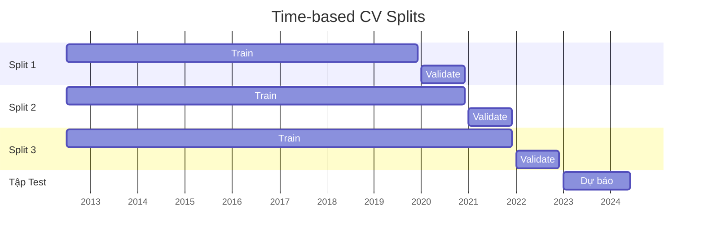

# Tóm tắt  
Bài toán Datathon 2026 yêu cầu dự báo **doanh thu thuần hàng ngày** (Revnue) cho giai đoạn 01/01/2023–01/07/2024 dựa trên dữ liệu mô phỏng từ 2012 đến 2022 gồm 15 bảng (Master, Transaction, Analytical, Operational). Đây không chỉ là bài toán *chuỗi thời gian* đơn thuần mà là **forecasting có biến ngoại sinh (exogenous variables)** vì doanh thu chịu ảnh hưởng từ khuyến mãi, tồn kho, traffic web, v.v. Mục tiêu kinh doanh gồm tối ưu tồn kho, lập kế hoạch khuyến mãi và logistics. Báo cáo này phân tích chi tiết từng bước: xác định biến đặc trưng (features) từ các bảng, xây dựng pipeline đặc trưng hàng ngày (ngày làm unit), các chiến lược thời gian (lag, rolling, biến thời vụ), tránh rò rỉ thông tin, phương án đánh giá và luyện mô hình (LightGBM/CatBoost/XGBoost, log-transform, ensemble), và cuối cùng là giải thích mô hình (SHAP) để rút ra insight kinh doanh. Kết quả kỳ vọng là mô hình cho MAE, RMSE thấp và R² cao trên tập validation/cv.

## 1. Phân tích bài toán và mục tiêu kinh doanh  
**Bản chất bài toán:** Dự báo doanh thu thuần hàng ngày (Revenue) là bài toán hồi quy *forecasting*, nhưng có nhiều nguồn tín hiệu bổ sung. Ngoài chuỗi doanh thu đơn lẻ, chúng ta có các biến **ngoại sinh** từ dữ liệu giao dịch và vận hành: lượng truy cập web (demand), chương trình khuyến mãi (marketing/giá), tồn kho (supply constraints), và các đặc tính khách hàng, sản phẩm. Do đó, đây là vấn đề **forecasting đa biến có giải thích (causal forecasting)** chứ không chỉ extrapolate chuỗi Revenue【12†L133-L142】【41†L212-L220】. 

**Mục tiêu kinh doanh:** Dự báo doanh thu hàng ngày giúp: 1) Tối ưu tồn kho (giảm tồn đọng hay khan hiếm); 2) Lập kế hoạch khuyến mãi (điều chỉnh chiến lược giảm giá); 3) Quản lý logistics (điều phối vận chuyển và nhân lực). Các chỉ số đánh giá (KPIs) là MAE, RMSE (càng thấp càng tốt) và R² (càng cao càng tốt) theo đề bài. MAE đo sai số tuyệt đối trung bình, ít nhạy với outliers; RMSE là căn bậc hai của MSE, **phạt mạnh hơn sai số lớn**【26†L85-L90】; R² đo tỉ lệ phương sai được giải thích. Tối ưu cho cả ba đảm bảo dự báo chính xác ổn định cả giá trị trung bình lẫn đầu ra lệch lớn.

## 2. Tổng quan dữ liệu  
Bộ dữ liệu gồm 15 file CSV, chia thành 4 nhóm:  
- **Master:** Tham chiếu (sản phẩm, khách hàng, khuyến mãi, địa lý). Ví dụ `products.csv` chứa `price`, `cogs`, phân loại (category, segment), `promotions.csv` chứa thông tin chương trình khuyến mãi, mức giảm giá.  
- **Transaction:** Giao dịch (đơn hàng, chi tiết đơn hàng, thanh toán, vận chuyển, trả hàng, đánh giá). Ví dụ `orders.csv` (ngày đặt, trạng thái, nguồn, thiết bị), `order_items.csv` (số lượng, giá sau KM, tiền giảm, promo áp dụng), `returns.csv`, `reviews.csv`. Các bảng này cho phép tính đơn hàng/ngày, giá trị trung bình đơn, tỉ lệ trả hàng, v.v.  
- **Analytical:** `sales.csv` (train) và `sales_test.csv` chứa Revenue và COGS hàng ngày. *Mỗi dòng* là bộ `(Date, Revenue, COGS)` duy nhất. Đây là mục tiêu huấn luyện và mẫu nộp (submission).  
- **Operational:** Tồn kho (`inventory.csv` theo tháng) và lượng truy cập web (`web_traffic.csv` theo ngày: phiên, unique visitors, page views, tỉ lệ thoát, thời gian trung bình phiên, conversion rate, nguồn traffic). Ví dụ, traffic và conversion là tín hiệu cầu (“demand funnel”), các chỉ số tồn kho như `stockout_days`, `fill_rate` là tín hiệu cung.  

Dữ liệu có thể liên kết nhờ khoá chính và ngoại khóa (ví dụ `order_id` giữa orders và order_items; `zip` liên kết khách hàng và địa lý; `product_id` liên kết sản phẩm-inventory). Chúng ta sẽ tổng hợp các bảng này thành một bảng **daily aggregate** để làm đầu vào cho mô hình. 

## 3. Kỹ thuật Feature Engineering  
**3.1 Bảng tổng hợp hàng ngày:** Chúng ta xây dựng bảng có một dòng cho mỗi ngày (ngày đặt hàng) trong tập train. Mỗi dòng bao gồm:
- **Ngày (Date)** – dùng làm key, thêm biến thời gian (day_of_week, month, quý, năm) và cờ cuối tuần, ngày lễ. Lưu ý, **mùa lễ Tết** (Tet) và các ngày lễ lớn (Black Friday, 8/3, 20/10, No-Pel/Noel…) là thời điểm doanh thu biến động mạnh. Ví dụ, có thể tích hợp lịch lễ Tiết Việt (nếu có tài liệu) hoặc ít nhất thêm cờ ngày thường/ lễ.【31†L270-L278】.  
- **Revenue (target)** – doanh thu thuần ngày (từ `sales.csv`).  
- **COGS** – giá vốn tương ứng (có thể dùng để kiểm tra lợi nhuận thô, hoặc tính tỉ lệ lãi gộp).  

Sau đó, gộp (join/agg) các bảng khác theo ngày:  
- **Web Traffic (hàng ngày)**: các cột `sessions`, `unique_visitors`, `page_views`, `bounce_rate`, `avg_session_duration_sec`, `conversion_rate`. Có thể tính thêm tương tác (ví dụ traffic × conversion_rate = đơn hàng tiềm năng). Ngoài ra, phân nhóm theo `traffic_source` (xem lượng tương tác theo kênh).  
- **Khuyến mãi (daily promo features):** Từ `promotions.csv` và `order_items.csv`, tính các chỉ số khuyến mãi mỗi ngày, ví dụ: tổng giá trị giảm (`discount_amount`), tỉ lệ ĐH có dùng promo, độ dốc giảm giá trung bình (discount rate = `discount_amount`/`unit_price`). Nếu có `promo_type` (%) vs (fixed), áp dụng phép tính tương ứng. Có thể thêm tính năng nhiều chương trình kích hoạt (stackable_flag).  
- **Tồn kho (monthly)**: Dữ liệu `inventory.csv` chụp cuối tháng cho mỗi sản phẩm. Có thể tổng hợp theo tháng (chuyển thành hàng đầu tháng) hoặc lấy snapshot mới nhất trước ngày dự báo. Ví dụ tính các chỉ số như tổng `units_received`, `stockout_days`, `fill_rate`, `days_of_supply`, `units_sold` của mỗi tháng và forward-fill cho các ngày trong tháng. Biến kho hết hàng (stockout_flag) hay lược đồ cảnh báo (`reorder_flag`) có thể cho thấy rủi ro thiếu hàng dẫn đến giảm doanh thu. Luôn lưu ý không dùng dữ liệu inventory *sau* ngày dự đoán (né rò rỉ).  
- **Orders & order_items:** Từ `orders.csv` và `order_items.csv`, tính số đơn hàng mỗi ngày, tổng số mặt hàng, doanh thu gộp (sum unit_price*quantity + discounts), số lượng sản phẩm bán ra, giá trị trung bình đơn (AOV), đơn hàng tối đa etc. Thêm biến: số ĐH hủy/trả (từ `order_status` hoặc bảng returns), tỉ lệ đổi trả (quantity trả/tổng bán ra). Có thể tách theo kênh (order_source), thiết bị, phương thức thanh toán để xem trend đặc thù.  
- **Returns:** Tính tổng lượng trả, tổng số tiền hoàn trả, tỉ lệ trả hàng theo ngày.  
- **Shipments:** Tính các chỉ số giao hàng trung bình (thời gian ship-delivery) hay phí vận chuyển trung bình (shipping_fee). Ví dụ đơn hàng giao chậm nhiều ngày có thể ảnh hưởng trải nghiệm (giảm mua sau).  
- **Khách hàng:** Từ `customers.csv`, thống kê số khách đăng ký mới mỗi ngày, phân phối theo thành phố/vùng (`zip`), theo kênh (acquisition_channel). Có thể tính tuổi trung bình (nếu `age_group`), tỉ lệ giới tính, nếu có giả định hữu ích.  
- **Sản phẩm:** Từ `products.csv`, có thể thêm thông tin category/segment đại diện cho mix sản phẩm bán ra mỗi ngày. Ví dụ % ĐH hoặc doanh thu từ phân khúc cao cấp (segment) so với tổng, hoặc giá trung bình sản phẩm ngày hôm đó.  
- **Đánh giá:** Từ `reviews.csv`, tính tổng số đánh giá và điểm trung bình (rating) mỗi ngày. Ví dụ, đợt hàng bán tốt thường có nhiều đánh giá tích cực, hoặc gắn với khuyến mãi tệ có thể tăng trả hàng.  

### Bảng biến (Features) đề xuất
| **Nguồn dữ liệu**         | **Ví dụ biến đặc trưng tổng hợp hàng ngày**                                                                                                                                           |
|---------------------------|----------------------------------------------------------------------------------------------------------------------------------------------------------------------------------------|
| **Web Traffic**           | *sessions*, *unique_visitors*, *page_views*, *bounce_rate*, *avg_session_duration_sec*, *conversion_rate*; tương tác kết hợp (e.g. sessions×conversion_rate)                           |
| **Promotion**             | Số chương trình kích hoạt, tổng *discount_amount*, tỉ lệ ĐH có promo, trung bình *discount_rate* (giảm/gốc) trong ngày, *stackable_flag*, *min_order_value*, chương trình theo kênh  |
| **Inventory**             | (theo tháng tính cho ngày tương ứng) tổng *units_received*, tổng *units_sold*, *stockout_days*, *days_of_supply*, *fill_rate*, *stockout_flag*, *overstock_flag*                           |
| **Orders/Order_items**    | Đếm số ĐH, tổng giá trị gộp, AOV (doanh thu/ĐH), số lượng sản phẩm bán, mặt hàng/ĐH trung bình, tỉ lệ ĐH huỷ, tỉ lệ trả hàng; ĐH theo kênh/devies/payment_method                        |
| **Payments**              | Tổng giá trị thanh toán, số kỳ thanh toán trung bình; phân bố phương thức (cash/Card/Installment)                                                                                     |
| **Shipments**             | Thời gian giao trung bình (delivery_date – ship_date), phí vận chuyển trung bình                                                                                                     |
| **Returns**               | Số lượng trả hàng, tỷ lệ trả (số lượng trả/số đã bán), tổng refund_amount, lý do trả hàng chính                                                                                       |
| **Reviews**               | Số đánh giá, điểm đánh giá trung bình (rating), chủ đề phổ biến                                                                                                                      |
| **Customers**             | Khách hàng mới/ngày, tỉ lệ mới/cũ, phân phối theo vùng/giới tính/độ tuổi/kênh tiếp thị                                                                                                |
| **Products**              | % doanh thu theo category (nữ/nam/bé), theo segment; giá trung bình sản phẩm bán trong ngày (sử dụng `price`); kích cỡ (size) phổ biến                                                     |

Ngoài ra, nên tạo các **biến trễ (lag)** và **thống kê trượt (rolling)**:  
- Lag đối với Revenue (lag 1, lag 7, lag 30 ngày), tương tự lag cho các biến chính như sessions, orders, discounts.  
- Rolling window (ví dụ 7-14-30 ngày): trung bình, phương sai, độ dốc (linear trend) của Revenue và các biến trên. Ví dụ, `Revnue_7d_mean`, `Visits_7d_std`.  
- Biến thời gian: *day_of_week*, *is_weekend*, *month*, *quarter*, và dấu hiệu lễ Tết. Ví dụ tạo cờ ngày lễ Việt Nam (tết Dương Lịch, Tết Nguyên đán, Quốc tế Phụ nữ...). Seasonality lặp lại hàng tuần và hàng năm rất rõ【31†L270-L278】.  

Quan trọng: **tránh rò rỉ dữ liệu (leakage)**. Mọi biến phải là thông tin *tại hoặc trước ngày dự đoán*. Ví dụ, không dùng **dịch vụ traffic/web tương lai**, không dùng trạng thái tồn kho cuối tháng *sau* ngày. Ví dụ Nixtla lưu ý: để dùng biến ngoại sinh, “bạn phải có dữ liệu tương lai về các biến này tại thời điểm dự đoán”【41†L212-L220】. Nghĩa là nếu sử dụng traffic hay promo, phải giả định lịch hoặc extrapolate (ví dụ traffic dịch vụ đặt lịch sẵn).  

## 4. Phương án đánh giá & phân chia dữ liệu  
**Chỉ số đánh giá:** Đề bài sử dụng đồng thời MAE, RMSE, R². RMSE “phạt” sai số lớn hơn MAE【26†L85-L90】, vì thế ta nên chú ý giảm outlier. Có thể mô hình hóa log(Revenue) (hoặc dùng RMSE loss) để giảm ảnh hưởng giá trị cực đại. 

**Cross-validation thời gian (Time-based CV):** Không được sử dụng *random split* vì vi phạm mối quan hệ thời gian【34†L47-L56】. Phải tuân theo “mũi tên thời gian”. Một cách phổ biến là **forward chaining / expanding window**【36†L1-L4】【34†L145-L153】. Ví dụ:  
- Split 1: Train từ 04/07/2012–31/12/2019, validate 01/01/2020–31/12/2020.  
- Split 2: Train 2012–2020, validate 2021.  
- Split 3: Train 2012–2021, validate 2022.  
Thậm chí có thể tạo thêm split nhỏ lẻ theo quý hoặc nửa năm. Minh hoạ timeline dưới đây cho thấy các lần chia:  



Các biến *rolling* nên tính chỉ dùng dữ liệu train trước ngày val. Ví dụ, khi validate 2021, chỉ dùng tới cuối 2020 để tạo lag/rolling.

**Protocol validation:** Trong báo cáo cần nêu rõ cách đánh giá (kết hợp MAE, RMSE, R²), và thực hiện đánh giá qua CV. Nên lưu ý có thể dùng Weighted-Linear hoặc Huber loss nếu muốn cân bằng MAE/RMSE. Công cụ có thể là `sklearn.model_selection.TimeSeriesSplit` hoặc tự code lượt lặp forward-chaining. 

## 5. Mô hình đề xuất  
Gradient boosting là lựa chọn an toàn và hiệu quả cho dữ liệu bảng lớn: **LightGBM**, **CatBoost**, **XGBoost**. Tài liệu LightGBM khẳng định framework này “đào tạo nhanh hơn, hiệu suất cao hơn, độ chính xác tốt hơn, hỗ trợ dữ liệu lớn”【20†L32-L40】. CatBoost mạnh mẽ về xử lý **dữ liệu phân loại** tự động, khử overfitting (Ordered Boosting) và tích hợp GPU, được sử dụng nhiều trong các cuộc thi và sản xuất【23†L41-L49】. XGBoost có lịch sử lâu đời và hiệu năng ổn định (nhưng chậm hơn LightGBM khi data lớn).

**Các biện pháp nâng cao:**  
- *Log-transform:* Dự báo `y = log1p(Revenue)` để giảm ảnh hưởng outlier lớn (doanh thu ngày lễ thường rất cao). Khi đánh giá, chuyển ngược. Log-transform làm RMSE nhạy hơn sai số tỉ lệ【26†L85-L90】.  
- *Ensemble:* Kết hợp nhiều mô hình (LGBM + CatBoost + XGB) thường cho hiệu quả hơn một model đơn. Có thể train trên cùng features khác tham số.  
- *Hyperparameter tuning:* Dùng thư viện Optuna/Hyperopt để tối ưu learning_rate, số lượng cây, max_depth, và các tham số riêng (lệch trọng số mất). CatBoost và LightGBM đều có nhiều tham số tùy chỉnh. Theo hướng dẫn LightGBM, có thể giảm `num_leaves` để tránh overfitting và tăng `min_data_in_leaf` để tăng tính khái quát【20†L32-L40】. Đánh giá trên tập validation (MAE/RMSE) và theo dõi độ ổn định (R²).  
- *Loss function:* Mặc định là MSE (RMSLE nếu log). Có thể thử `objective='quantile'` để trực tiếp tối ưu MAE/quartile (nhưng cẩn trọng vì quan trọng R²).  

**Chiến lược modeling:**  
- Lập pipeline học máy: chia data thành train/val theo lịch, encode categoricals (CatBoost tự làm tốt).  
- Feature scaling không cần thiết nhiều vì tree-based không nhạy biên độ.  
- Xử lý missing (nếu có): CatBoost tự xử lí NA; LightGBM thì có thể ấn định giá trị thiếu.  
- Tăng cường (enrich data): Ví dụ rollover features ở nhiều độ dài, tương tác (traffic × conversion).  

**Phân tích so sánh mô hình:**

| Mô hình    | Ưu điểm                                  | Nhược điểm                            | Ghi chú               |
|------------|------------------------------------------|---------------------------------------|-----------------------|
| LightGBM   | Huấn luyện rất nhanh, hiệu quả cao, hỗ trợ data lớn【20†L32-L40】 | Ít hỗ trợ categorical (phải mã hoá)    | Mạnh với features numeric/LI near. |
| CatBoost   | Tự xử lý categorical, khử overfitting tốt, GPU, độ chính xác cao【23†L41-L49】 | Huấn luyện chậm hơn LightGBM          | Dùng default mạnh, ít cần tuning. |
| XGBoost    | Ổn định, nhiều tham số                | Chậm hơn LightGBM, cần tunning kĩ  | Nhiều người dùng, benchmark.     |

## 6. Kế hoạch triển khai và báo cáo  
**Pipeline code:** Nên xây dựng theo dạng script/notebook có cấu trúc rõ ràng: đọc dữ liệu, gộp thành bảng daily, feature engineering (lag, rolling, merge), chia train/validation, huấn luyện mô hình, đánh giá CV, chuẩn bị file submission. Dùng GitHub để quản lý mã (báo cáo bắt buộc đính link GitHub công khai). Có thể dùng `pandas`/`dask` (cho dữ liệu lớn), `scikit-learn` để tiền xử lý, `lightgbm`, `catboost`, và thư viện `shap` để phân tích feature. 

**Đầu ra (submission.csv):** Định dạng giống `sample_submission.csv`: mỗi dòng `Date, Revenue, COGS`. Dự báo Revenue cho test, COGS nếu cần (hoặc để NA nếu không dùng). Không sắp xếp lại thứ tự, giữ ngày theo thứ tự thời gian.

**Đánh giá nội bộ (validation protocol):** Chạy CV theo forward-chaining nêu trên, ghi lại MAE/RMSE/R² trung bình mỗi split. Sử dụng MLflow hoặc Weights&Biases để log kết quả từng thử nghiệm nhằm đảm bảo reproducibility và so sánh kết quả. Ghi chú các setting của từng model (seed, tham số, tập features). 

**Giải thích mô hình (XAI):** Sau khi có model tốt nhất, dùng **SHAP** để đo độ quan trọng tính năng (feature importance) và ảnh hưởng từng giá trị lên dự báo. Nixtla khuyến khích dùng SHAP cho biến ngoại sinh, vì nó cho thấy “mỗi biến đóng góp bao nhiêu vào dự báo từng bước”【41†L212-L220】. Ví dụ, có thể biểu diễn plot tóm tắt SHAP (summary_plot) để xem biến như traffic, promo, inventory ảnh hưởng thế nào. Những hiểu biết này cần đưa vào báo cáo: ví dụ “Traffic tăng dẫn đến doanh thu tăng” hay “Giảm giá sâu tăng doanh thu tức thời nhưng làm giảm margin”. 

**Kết quả báo cáo:** Viết báo cáo 4 trang LaTeX (theo template NeurIPS). Bao gồm: EDA và trực quan hoá (so sánh Revenue theo mùa, so sánh doanh thu theo category, mối liên hệ giữa traffic và sales…), phương pháp (feature, modeling, CV), kết quả CV, kết quả SHAP & insight kinh doanh. Đính kèm link GitHub có code pipeline và file nộp. 

## 7. Kế hoạch, bảng so sánh và biểu đồ  
### Bảng tính năng đề xuất (Features)  
Trên đây là tổng hợp ví dụ; trong pipeline thực tế, có thể liệt kê chi tiết hơn.  

### Kế hoạch và timeline  
Dự kiến (13 tuần, tương ứng ~khi học kỳ):  

| Pha/Công việc                   | Tuần                  | Ghi chú                                                           |
|---------------------------------|-----------------------|--------------------------------------------------------------------|
| **1. EDA & Hiểu dữ liệu**       | 1–2                   | Khảo sát dữ liệu, biểu đồ Revenue theo thời gian, phân bổ, seasonality.  |
| **2. Xây dựng bảng Daily**      | 2–3                   | Gộp các nguồn dữ liệu vào bảng daily; tạo biến thời gian, holiday. |
| **3. Feature Engineering**      | 3–5                   | Tạo lag, rolling, biến tổ hợp; thử nhiều ý tưởng; kiểm tra leakage. |
| **4. Xây dựng mô hình baseline**| 5–6                   | LGBM/CatBoost ban đầu, chỉ sử dụng features cốt lõi; đánh giá CV.    |
| **5. Tối ưu & Ensemble**        | 6–8                   | Tuning tham số (Optuna), thêm model, ensemble nhiều mô hình.        |
| **6. XAI & Insight**            | 8–9                   | Phân tích SHAP, giải thích kết quả, trích xuất insight.            |
| **7. Viết báo cáo & Hoàn thiện**| 9–10                  | Viết báo cáo LaTeX, chuẩn bị submission.csv, hoàn thiện mã.        |

```mermaid
flowchart TD
    A[Đọc dữ liệu và EDA ban đầu] --> B[Xây dựng bảng daily tổng hợp]
    B --> C[Feature Engineering (lag, rolling, time_feats)]
    C --> D[Lập mô hình (LGBM/CatBoost/XGB)]
    D --> E[Tuning & Ensemble]
    E --> F[Kiểm thử (CV thời gian)]
    F --> G[Giải thích (SHAP) & Insight Kinh doanh]
    G --> H[Chuẩn bị nộp (submission, báo cáo)]
```

## 8. Tổng kết  
Để giành điểm cao, tập trung vào **feature engineering dựa trên logic kinh doanh** và đánh giá nghiêm ngặt. Mô hình mạnh (LightGBM/CatBoost) chỉ là công cụ; điểm quyết định là chọn đúng biến và xử lý thời gian chuẩn. Kết quả tốt đòi hỏi mỗi feature “vừa thực, vừa có ý nghĩa”: ví dụ *traffic web tăng → doanh thu tăng*, *promotions kích thích tăng đơn nhưng cần theo dõi hoàn trả*, *hết hàng (stockout) làm giảm doanh thu*【31†L270-L278】【41†L212-L220】. CV phải đúng cách (không rò rỉ), quan sát MAE/RMSE/R² ở mỗi bước để tối ưu đồng thời. Báo cáo rõ ràng, có trực quan (biểu đồ doanh thu theo mùa, phân phối đơn hàng, mối liên hệ giữa traffic và sales…) và giải thích mô hình (SHAP) mang góc nhìn kinh doanh sẽ là điểm cộng lớn.

**Nguồn tham khảo:** LightGBM docs【20†L32-L40】, CatBoost giới thiệu【23†L41-L49】, bài viết về cross-validation thời gian【34†L47-L56】【36†L1-L4】, hướng dẫn SHAP cho biến ngoại sinh【40†L1-L4】【41†L212-L220】, định nghĩa MAE/RMSE【26†L85-L90】, và tài liệu về seasonality trong kinh doanh【31†L270-L278】. Các tri thức này kết hợp với EDA và trực giác kinh doanh là chìa khoá chiến thắng cho Datathon 2026.